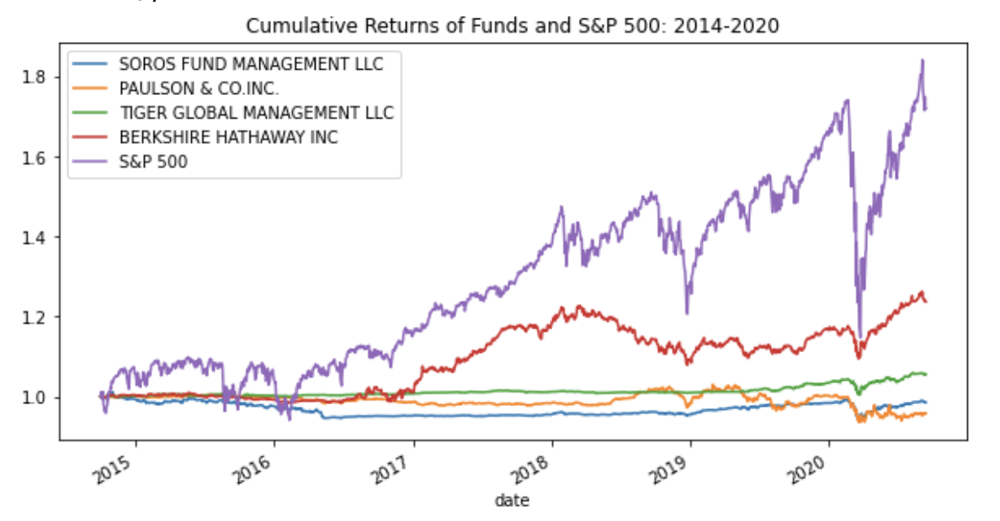
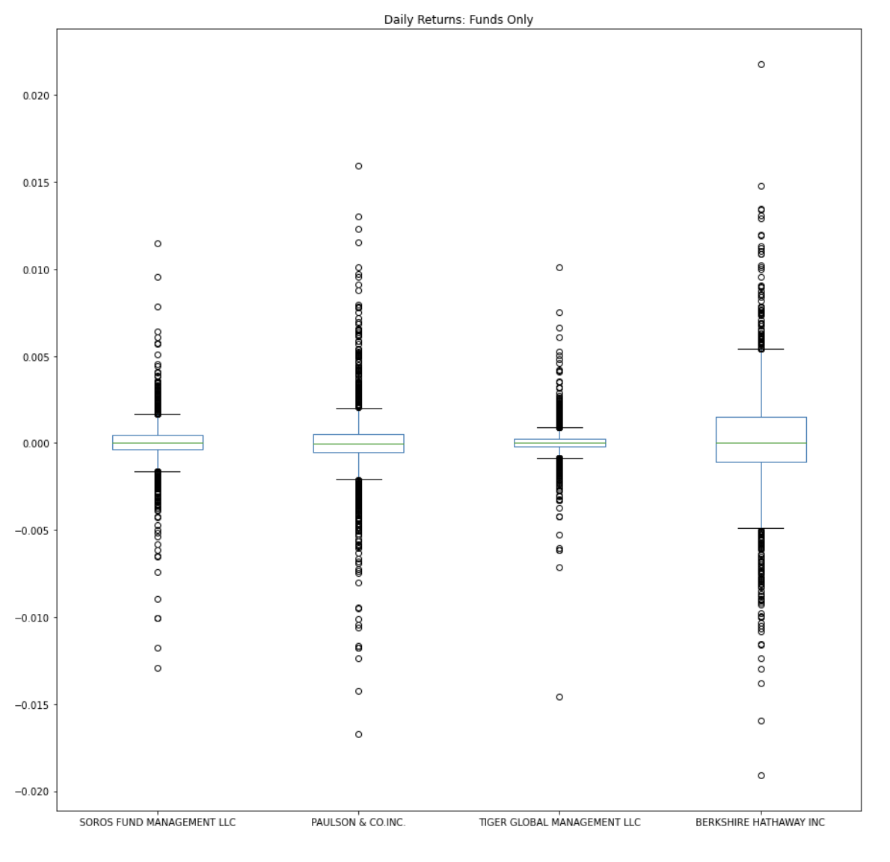
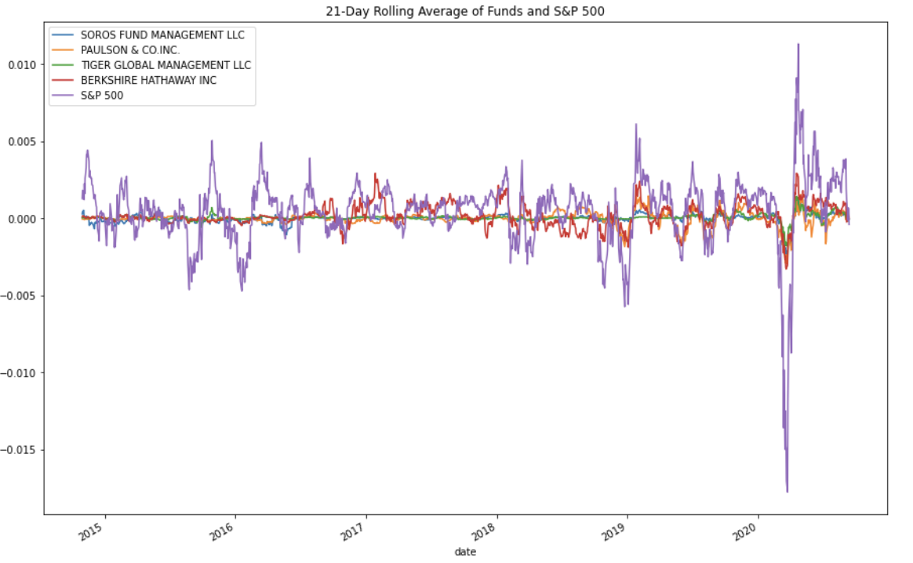
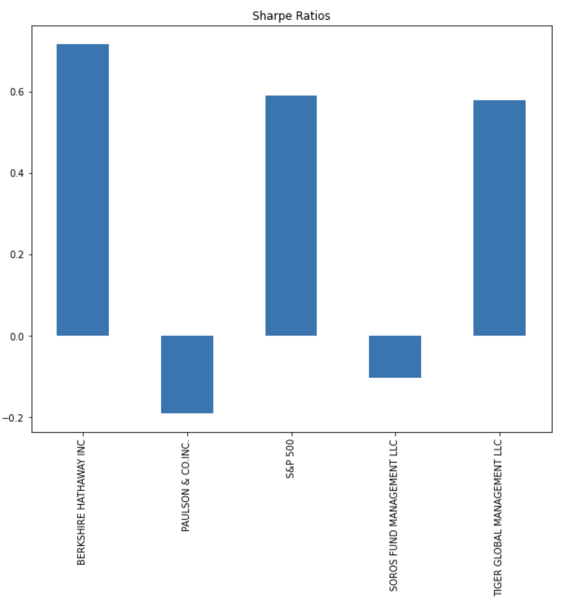
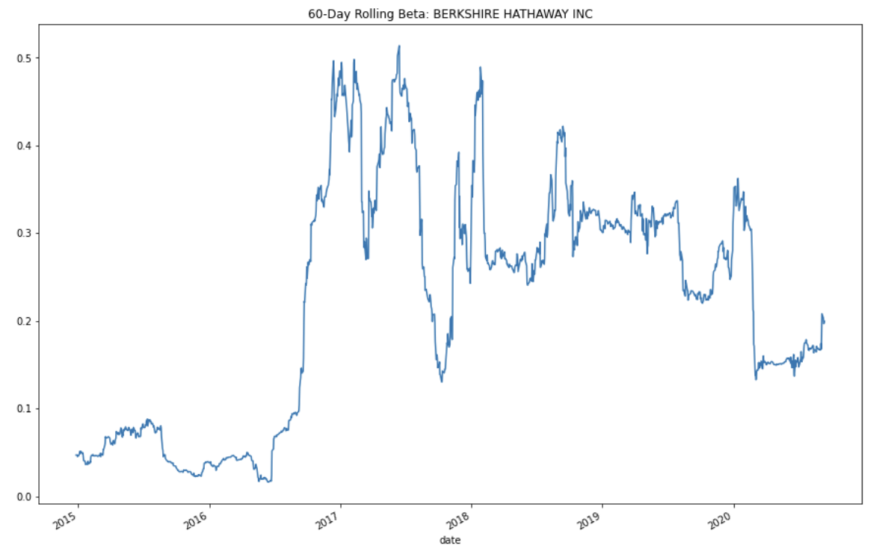
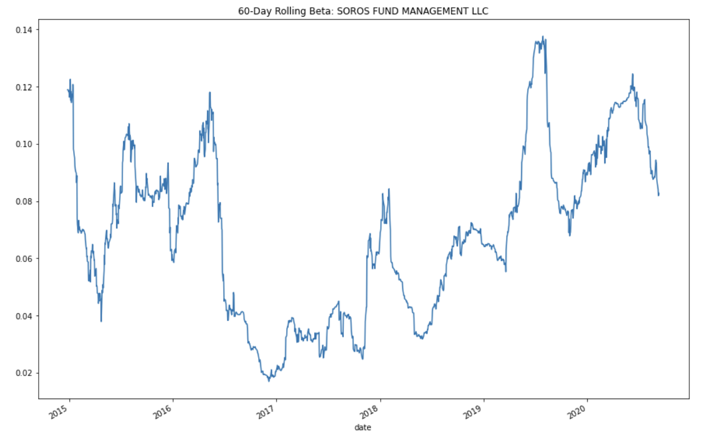

# Portfolio Management

Evaluating four new investment options for inclusion in client portfolios. This program helps determine the fund with the most investment potential based on key risk-management metrics: the daily returns, standard deviations, Sharpe ratios, and betas.

---

## Technologies

This project leverages python 3.7 with the following:

* [JupyterLab](https://jupyterlab.readthedocs.io/en/stable/) - JupyterLab is a web-based user interface designed for data analysis.

* [pandas](https://github.com/pandas-dev/pandas) - Flexible and powerful data analysis / manipulation library for Python.

* [numpy](https://github.com/numpy/numpy) - The fundamental package for scientific computing with Python.

* [matplotlib inline](https://github.com/matplotlib/matplotlib) - Comprehensive library for creating static, animated, and interactive visualizations in Python.

---

### Installation Guide

Before running the application first install the following dependencies.

```python
  pip install jupyterlab
  pip install pandas
  pip install numpy
  pip install matplotlib
```

---

## Examples

**Creating daily returns DataFrame based on NAV prices of the Four Portfolios and on closing price of the S&P 500.**
```
daily_returns = whales_df.pct_change().dropna()
daily_returns.head()

```
**Visualizing the daily returns data of the Four Fund Portfolios and the S&P 500 using Pandas plot function.**
```
daily_returns.plot(figsize=(10,7), title="Daily Returns")

```

**Calculating, creating, and displaying the last five rows of cumulative returns DataFrame for the Four Fund Portfolios and the S&P 500.**
```
cumulative_returns = (1 + daily_returns).cumprod()
cumulative_returns.tail()
```

**Visualizing the cumulative return data of the Four Fund Portfolios and the S&P 500 using Pandas plot function.**
```
cumulative_returns.plot(figsize=(10,5), title="Cumulative Returns of Funds and S&P 500: 2014-2020")

```

**Visualizing the daily return data of the Four Fund Portfolios and the S&P 500 using Pandas plot function and box plot parameter.**
```
daily_returns.plot.box(figsize=(15,20), title="Daily Returns of Funds and S&P 500")

```

**Calculating standard deviation of the Four Fund Portfolios and the S&P 500; sorted from smallest to largest.**
```
standard_deviation = daily_returns.std().sort_values()
standard_deviation
```

**Calculating annualized standard deviation of the Four Fund Portfolios and the S&P 500; sorted from smallest to largest.**
```
year_trading_days = 252
annualized_standard_deviation = standard_deviation * np.sqrt(year_trading_days)
annualized_standard_deviation.sort_values()

```

**Visualizing the 21-day Rolling Average of the Four Fund Portfolios and the S&P 500.**
```
daily_returns.rolling(window=21).mean().plot(figsize=(15,10), title="21-Day Rolling Average of Funds and S&P 500")

```

**Calculating the Sharpe Ratio of the Four Fund Portfolios and the S&P 500.**
```
sharpe_ratios = average_annual_return / annualized_standard_deviation
sharpe_ratios.sort_values()

```

**Visualizing the Sharpe Ratios of the Four Fund Portfolios and the S&P 500 in a bar chart.**
```
sharpe_ratios.plot.bar(figsize=(10,8),title="Sharpe Ratios")

```

**Calculating the variance of the S&P 500 by using a 60-day rolling window and Pandas var function.**
```
spy_rolling_60_variance = daily_returns['S&P 500'].rolling(window=60).var()
spy_rolling_60_variance.tail()

```

**Calculating the covariance of Berkshire Hathaway Inc by using a 60-day rolling window, Pandas var function, and S&P 500.**
```
profit_per_trade_early.plot(figsize=(10, 7), title="Profit Per Trade - Early Date", color="green")

```

**Calculating the beta of Berkshire Hathaway Inc based on the 60-day rolling covariance; listing last five rows of info.**
```
brk_rolling_60_beta = brk_rolling_60_covariance / spy_rolling_60_variance
brk_rolling_60_beta.tail()

```

**Calculating the average value of the 60-day rolling beta of Berkshire Hathaway Inc.**
```
brk_rolling_60_beta_mean = brk_rolling_60_beta.mean()
brk_rolling_60_beta_mean

```

**Visualizing the 60-day rolling beta of Berkshire Hathaway Inc.**
```
brk_rolling_60_beta.plot(figsize=(15,10), title="60-Day Rolling Beta: BERKSHIRE HATHAWAY INC")

```
---

## Usage

To use the portfolio management application simply clone the repository and run the **risk_return_analysis.py** with:

```python
python risk_return_analysis.py
```

Below you will find screenshots of varios visualizations demonstrated to help drive analysis.














---

## Contributors

Brought to you by Robert Giannini.
LinkedIn: https://www.linkedin.com/in/robertgianninijr/

---

## License

MIT